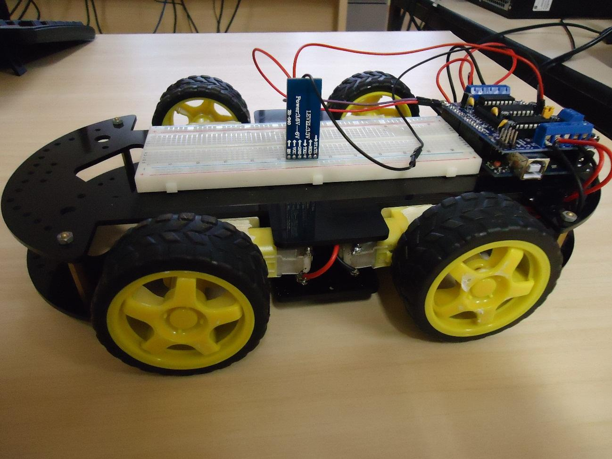

# Projeto Arduino de carrinho
Um projeto feito no curso técnico em 2015, feito para entender o funcionamento do Arduíno com placas adicionais(os shields).

Neste projeto foi utilizado: 
- Arduino uno;
- Sensor ultrassônico HC-SR04;
- Módulo bluetooth HC-05;
- Motor Shield L293D Driver Ponte H para Arduino;
- 4 Motores DC 3-6V com Caixa de Redução e Eixo Duplo.

Para a comunição bluetooth, foi utilizado um smartphone com o app de controle remoto. Os comandos foram remapeados no aplicativo para que o programa reconheça a ordem para executar.

